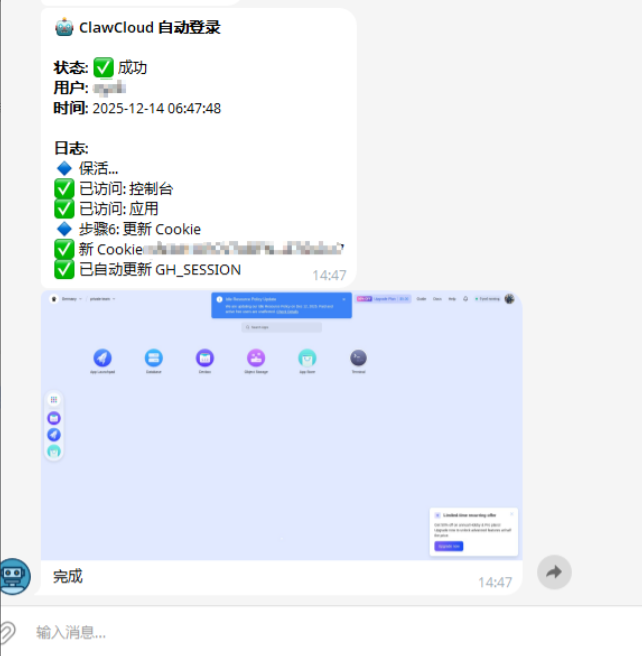
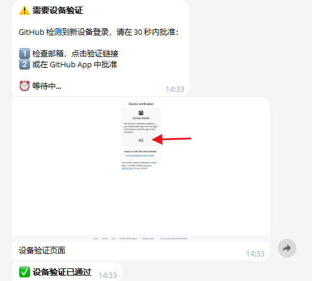

# ⭐ Star 星星走起 动动发财手点点 ⭐

## ClawCloud 官网(GitHub注册送5美元地址)：[run.claw.cloud](https://console.run.claw.cloud/signin?link=M9P7GXP3M3W5)

> 自动登录 ClawCloud，保持账户活跃，支持设备验证 + 两步验证



---

## ⚠️ 注意事项

- 支持 **Mobile验证** 和 **2FA验证** `建议:Mobile验证 直接下载github app 只需要首次验证之后，后面不需要再次验证。`
- 首次运行：需要设备验证，收到 TG 通知后 **30 秒内** 批准
- REPO_TOKEN：需要有 `repo` 权限才能自动更新 Cookie
- Cookie 有效期：每次运行都会更新，保持最新

---

## 🔐 Secrets 配置

| Secret 名称 | 必需 | 说明 |
|-------------|------|------|
| `GH_USERNAME` | ✅ | GitHub 用户名 |
| `GH_PASSWORD` | ✅ | GitHub 密码 |
| `REPO_TOKEN` | ✅ | GitHub PAT（用于自动更新 Cookie） |
| `TG_BOT_TOKEN` | ✅ | Telegram Bot Token |
| `TG_CHAT_ID` | ✅ | Telegram Chat ID |
| `GH_SESSION` | ❌ | 自动生成，无需手动添加 |

---

# 🚀 完整操作指南 - 分步骤详解

---

## 第一步：Fork 仓库

```
1. 打开原仓库页面
2. 点击右上角 "Fork" 按钮
3. 点击 "Create fork"
4. 等待跳转到你的仓库副本
```

---

## 第二步：创建 Telegram Bot

### 2.1 创建 Bot

```
1. Telegram 搜索 @BotFather
2. 发送 /newbot
3. 输入名称: ClawCloud Alert
4. 输入用户名: clawcloud_xxx_bot（需唯一）
5. 保存获得的 Token: 6123456789:AAHxxxxx...
```

### 2.2 获取 Chat ID

```
1. 找到刚创建的 Bot，发送: hello
2. 浏览器访问: https://api.telegram.org/bot<你的Token>/getUpdates
3. 找到 "chat":{"id":123456789}
4. 保存这个数字: 123456789
```

---

## 第三步：启用 GitHub 验证方式

> 选择你要使用的验证方式进行设置

### 方式 A：启用 GitHub Mobile 验证

#### A.1 安装 GitHub Mobile App

```
iOS: App Store 搜索 "GitHub"
Android: Google Play 搜索 "GitHub"

安装后登录你的 GitHub 账号
```

#### A.2 首次开启两步验证

```
1. 浏览器打开: https://github.com/settings/security
2. 找到 "Password and authentication"
3. 点击绿色 "Enable two-factor authentication"
4. 选择 "GitHub Mobile" 选项
5. 点击旁边的 "Show" 查看设置
6. 按提示在手机 App 上确认绑定
```

#### A.3 设置为首选验证方式（如已开启2FA）

```
1. 浏览器打开: https://github.com/settings/security
2. 找到 "Two-factor methods"
3. 找到 "GitHub Mobile"
4. 点击 "Set as preferred" 设为首选
```


#### A.4 验证设置成功

```
确认显示:
GitHub Mobile ✓ Preferred
```

---

### 方式 B：启用 2FA (TOTP) 验证

#### B.1 下载 Authenticator App

```
推荐应用（任选其一）:
- Google Authenticator
- Microsoft Authenticator
- Authy
- 1Password
```

#### B.2 首次开启两步验证

```
1. 浏览器打开: https://github.com/settings/security
2. 找到 "Password and authentication"
3. 点击绿色 "Enable two-factor authentication"
4. 选择 "Authenticator app" 选项
5. 用 Authenticator App 扫描二维码
6. 输入 App 显示的 6 位验证码确认
7. 保存恢复码（Recovery codes）到安全位置
```

#### B.3 验证设置成功

```
确认 Security 页面显示:
Authenticator app ✓
```

> 💡 **使用方法见 [第六步：响应验证请求](#第六步响应验证请求)**

---

## 第四步：配置 GitHub Secrets

### 4.1 进入 Secrets 页面

```
你的仓库 → Settings → Secrets and variables → Actions
```

### 4.2 添加 GitHub PAT

```
1. 打开: https://github.com/settings/tokens
2. Generate new token (classic)
3. Note: ClawCloud
4. Expiration: No expiration
5. 勾选: ✅ repo
6. Generate token → 复制 Token
7. 回到 Secrets 添加:
   Name: REPO_TOKEN
   Secret: ghp_xxxxxxxxxxxx
```

### 4.3 添加其他 Secrets

点击 "New repository secret" 依次添加：

| Name | Secret（填入的值） |
|------|-------------------|
| `GH_USERNAME` | 你的 GitHub 用户名 |
| `GH_PASSWORD` | 你的 GitHub 密码 |
| `TG_BOT_TOKEN` | 第二步的 Token: `6123456789:AAHxxxxx...` |
| `TG_CHAT_ID` | 第二步的 Chat ID: `123456789` |
| `REPO_TOKEN` | 第四步的4.2 GitHub PAT: `ghp_xxxxxxxxxxxx` |

### 4.4 确认完成

```
应该有 5 个 Secrets:
✅ GH_USERNAME
✅ GH_PASSWORD
✅ REPO_TOKEN
✅ TG_BOT_TOKEN
✅ TG_CHAT_ID
```

---

## 第五步：启用 Actions 并运行

### 5.1 启用 Actions

```
1. 点击仓库顶部 "Actions"
2. 点击 "I understand my workflows, go ahead and enable them"
```

### 5.2 手动运行测试

```
1. 左侧点击 "ClawCloud 自动登录保活"
2. 点击 "Run workflow"
3. 点击绿色 "Run workflow" 按钮
```

### 5.3 查看运行日志

```
点击新出现的运行记录 → 点击 "auto-login" 查看实时日志
```

---

## 第六步：响应验证请求

> 运行时根据你设置的验证方式进行操作

### 如果使用 Mobile 验证

```
1. 收到 Telegram 通知: "🔐 需要 GitHub Mobile 验证"
2. 30秒内打开手机 GitHub App
3. 输入通知中显示的数字
4. 完成 ✅
```



---

### 如果使用 2FA 验证

```
1. 收到 Telegram 通知: "🔐 需要两步验证码"
2. 打开 Authenticator App 查看 6 位验证码
3. 在 Telegram 发送: /code 847293
4. 完成 ✅
```


---

## ✅ 完成检查

```
✅ Fork 完成
✅ Telegram Bot 创建完成
✅ GitHub 验证方式已设置（Mobile 或 2FA）
✅ 5 个 Secrets 已添加
✅ Actions 已启用
✅ 首次运行成功
```

## **🎉 配置完成！**

---

## 📊 流程图

```
┌─────────────────────────────────────────────────────────┐
│  1. 打开 ClawCloud 登录页                                │
│         ↓                                               │
│  2. 点击 "GitHub" 登录按钮                               │
│         ↓                                               │
│  3. GitHub 认证                                         │
│     ├── 输入用户名/密码                                  │
│     ├── 设备验证 (如需要) → 等待30秒/邮件批准             │
│     └── 两步验证 (如需要)                                │
│         ├── GitHub Mobile → 等待手机批准                 │
│         └── TOTP → 通过 Telegram /code 123456 输入       │
│         ↓                                               │
│  4. OAuth 授权 (如需要)                                  │
│         ↓                                               │
│  5. 等待重定向回 ClawCloud                               │
│         ↓                                               │
│  6. 保活操作 (访问控制台/应用页面)                        │
│         ↓                                               │
│  7. 提取新 Cookie 并保存/通知                            │
└─────────────────────────────────────────────────────────┘
```

---

## 📁 文件结构

```
.
├── .github/
│   └── workflows/
│       └── auto_login.yml    # GitHub Actions 配置
├── scripts/
│   └── auto_login.py         # 自动登录脚本
├── 1.png                      # Mobile 验证截图
├── 2.png                      # 设置截图
├── 3.png                      # 主截图
├── 4.png                      # 2FA 截图
└── README.md
```

---

## 🐛 常见问题

### Q: 设备验证超时怎么办？
A: 确保 Telegram 通知已配置，收到通知后立即在邮箱或 GitHub App 批准。

### Q: 2FA 验证码怎么输入？
A: 在 Telegram 发送 `/code 123456`（替换为你的 6 位验证码）。

### Q: Cookie 更新失败？
A: 检查 `REPO_TOKEN` 是否有 `repo` 权限。

### Q: 为什么需要 GitHub 密码？
A: 用于 Cookie 失效时重新登录，密码存储在 GitHub Secrets 中，安全可靠。

---

## 📄 License

MIT License

---

## 🤝 贡献

[感谢：axibayuit-a11y佬](https://github.com/axibayuit-a11y) 优化：支持了2fa验证

欢迎提交 Issue 和 Pull Request！

⭐ 如果对你有帮助，请点个 Star 支持一下！
